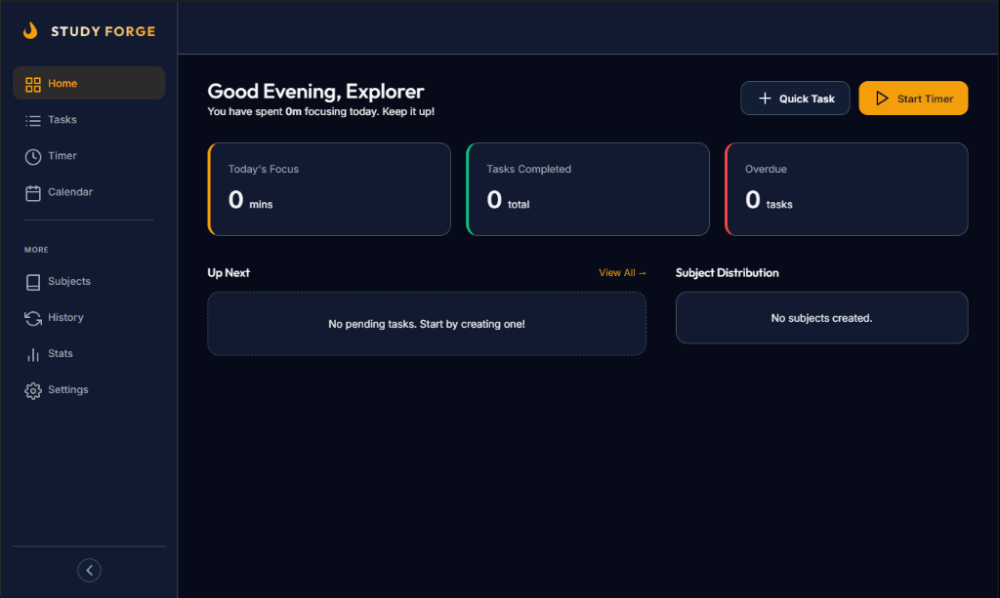

# 🛡️ StudyForge — Focus Command Center



> **Forge your future, one focus block at a time.**

StudyForge is a premium, distraction-free study management platform designed for high-performance students and lifelong learners. It combines a **24-hour Weekly Planner**, a **Deep Focus Timer**, and **Comprehensive Analytics** into a single, unified "Command Center" that turns your study sessions into measurable progress.

---

## ✨ Key Features

### 📅 Weekly Grid Planner
Visualize your entire week at a glance. Our 24-hour CSS Grid planner allows you to map out study blocks, lectures, and breaks with precision.

### ⏱️ Deep Focus Timer
Enter the flow state with our custom focus engine.
- **Multiple Modes**: Support for Standard Study, Mock Tests, Writing, and Revision.
- **Session Logging**: Automatically tracks your focus time and triggers break reminders.
- **Distraction-Free Mode**: Collapse the UI into a minimal footprint to keep your screen clear.

### 📊 Performance Analytics
Don't just study—measure your efficiency.
- **Focus Ratings**: Rate your concentration after every session.
- **Subject Distribution**: See exactly where your time is going with color-coded charts.
- **Session History**: A detailed log of every minute spent forging your skills.

### 🌓 Premium Dark Mode
Styled with a bespoke "Midnight Navy" and "Amber" palette. StudyForge is optimized for late-night sessions with a layout that's easy on the eyes and high on aesthetic.

---

## 🛠️ The Tech Stack

- **Core Engine**: Vanilla JavaScript (ESM)
- **Styling**: Vanilla CSS with Modern Layout Engines (Grid & Flexbox)
- **Persistence**: LocalStorage (Session-based)
- **Icons**: Custom Integrated SVG Library

---

## 🚀 Getting Started

### Prerequisites
- [Node.js](https://nodejs.org/) (recommended for local serving)

### Installation
1.  **Clone the Repository**:
    ```bash
    git clone https://github.com/phonechild51-max/Study-forge-antigravity.git
    cd Study-forge-antigravity
    ```

2.  **Serve Locally**:
    We recommend using `serve` or `live-server` for the best ESM experience.
    ```bash
    npx serve
    ```

3.  **Open in Browser**:
    Navigate to `http://localhost:3000`.

---

## 📄 License
This project is for personal educational use. See the repository owner for licensing details.

---

*Built with passion by StudyForge Team.*
